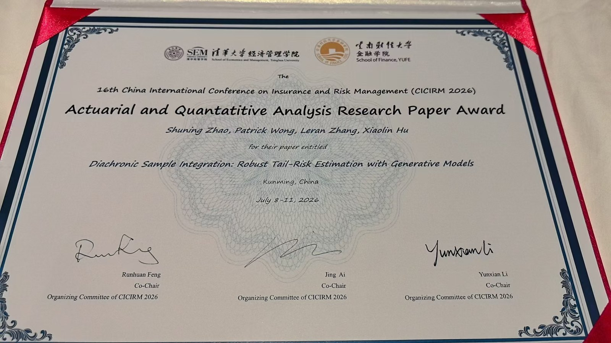

I'm delighted to share that our paper, **Diachronic Sample Integration: Robust Tail-Risk Estimation with Generative Models,** received the Honorary Award for Excellent Paper in Actuarial and Quantitative Analysis at CICIRM 2026.

The paper introduces Diachronic Sample Integration (DSI), a framework for improving the reliability of tail-risk estimates produced by generative models by reducing estimation instability and improve the measurement of tail-dependent quantities such as Value-at-Risk and Expected Shortfall.

This recognition means a great deal to us, and I am grateful to my co-authors, collaborators, the conference organizers, and everyone who provided feedback throughout the project.

We are excited to continue developing this work and hope for the very best as the paper moves forward in its publication journey.

The full paper is available on [arXiv](https://arxiv.org/abs/2607.10810), with further detail on the [publication page](/publication/arxiv2026/) and the [presentation announcement](/talk/cicirm-2026-diachronic-sample-integration/).
